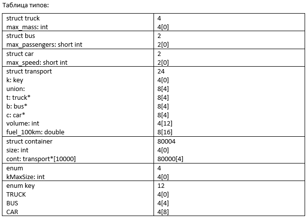
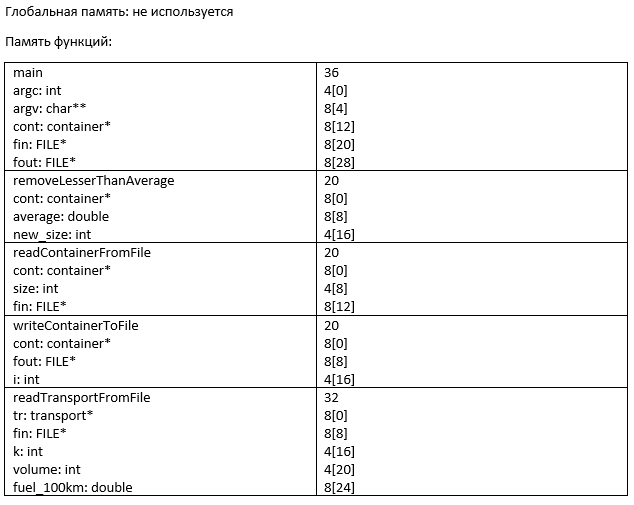
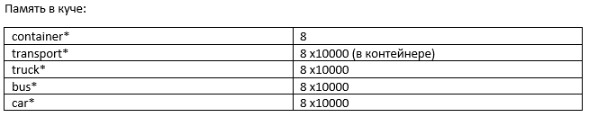
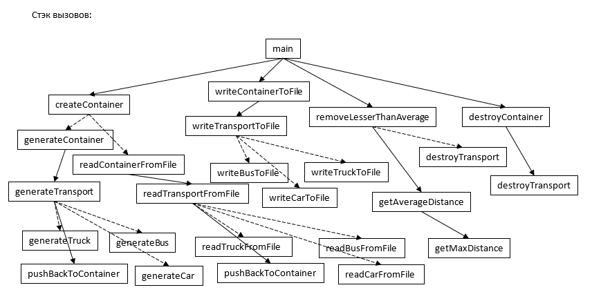

Домашнее задание №1 по Архитектуре Вычислительных Систем

# Заявка на бонус
- 1: разбиение на модули; раздельная компиляция (вынес файлы в библиотеку); применение системы сборки проектов cmake; тест №4 с полностью некорректными данными.
- 2: передача аргументов в методы по указателям и константным ссылкам - лишнее копирование не производится, причём за счёт разделения на ссылки и указатели повышается читаемость кода в точке вызова метода.

# Описание задания
Вариант №294: задача №14, функция №21. Для запуска из командной строки нужно передать в качестве аргументов названия входного и выходного файлов. Во входном файле сначала передаётся количество элементов в контейнере, а затем, если оно не превышает 20, элементы в формате "номер_типа_транспорта объём_бака расход_топлива специальные_данные_для_конкретного_типа_транспорта".

# Схема программы на базе ВС

# Метрики программы
Общий размер файлов исходного кода: 10.8 Кб
Размер исполняемого файла: 52.8 Кб
Интерфейсных модулей: 6
Модулей реализации: 7
Время работы на тестах:
- 1: 0.074с
- 2: 0.015с
- 3: 0.015с
- 4: 0.015с
- 5: 0.139с
